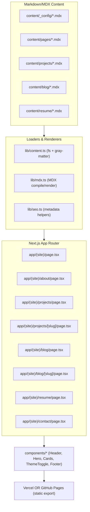
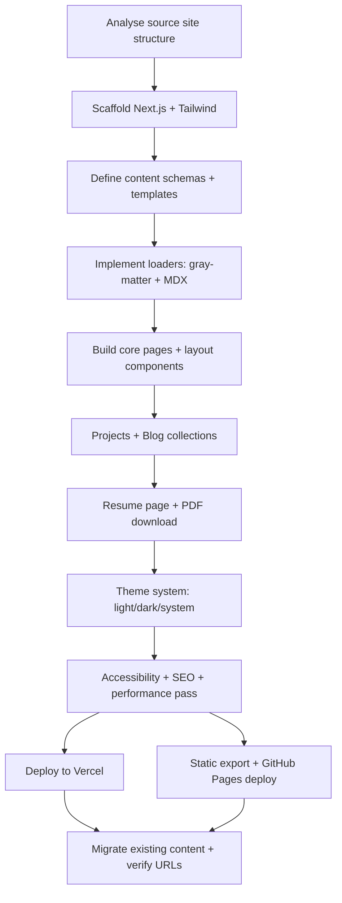

# Markdown-driven Next.js Portfolio inspired by tjdevworks.github.io

## Executive summary

The source site (`https://tjdevworks.github.io/`) is a clean, one-page personal portfolio with a simple top navigation (Home, Posts, Contact), a three-mode colour theme control (Light/Dark/Automatic), and a hero panel containing a profile image, name, role, affiliation, and social links. citeturn1view0 The main page flows through “whoami” (intro), Interests, Education, Experience, Accomplishments, Recent Posts, and Contact. citeturn1view0 Individual posts live under `/post/<slug>/` and are intentionally short, often linking out to longer external posts, and include share actions plus an author card. citeturn6view0turn9view0 A “Talk” content type exists (example under `/talk/example-talk/`) with structured metadata (date, event, location) and guidance around slides embedding. citeturn11view0

This report proposes a modern Next.js (React) rebuild that keeps the source site’s strengths—clarity, fast scanning, and “about + experience + posts + contact”—but improves maintainability and extensibility by making **all content and configuration markdown-driven** (MD/MDX + frontmatter), enabling: a dedicated Projects section, a fuller Blog index, a proper Resume page with **one-click PDF download**, better SEO primitives, and a consistent component system. The deliverables below include: a Codex-ready generation prompt; a complete folder structure; MD/MDX schemas and template files; a component contract (props + behaviour); accessibility/SEO/performance requirements and a testing checklist; a theme system specification; deployment instructions for GitHub Pages and Vercel; implementation snippets (MDX parsing, pages, resume download, styling); and a migration plan from the existing URL/content structure into the new Next.js structure.

## Source site analysis

### Information architecture and content patterns

The source site behaves primarily like a single-page portfolio with sections for identity, background, and contact. The visible structure includes:

- Top navigation items: **Home**, **Posts**, **Contact**. citeturn1view0  
- Theme modes: **Light**, **Dark**, **Automatic**. citeturn1view0  
- Hero: profile image, name “Tejas Mahajan”, role “Computer Science Graduate Student”, affiliation “Courant Institute of Mathematical Sciences (NYU)”, and social links (Twitter, GitHub, LinkedIn, Medium). citeturn1view0  
- Main sections: **whoami**, **Interests**, **Education**, **Experience**, **Accomplishments**, **Recent Posts**, **Contact**. citeturn1view0  

Posts are located under `/post/` with individual entries such as:

- `/post/cartoonize/` (title + date + “1 min read” + link-out to an external article). citeturn6view0  
- `/post/firstmover_fastfollower/` (title + date + “1 min read” + credit line for the image + link-out to an external Medium post). citeturn9view0  

Each post page includes share actions/icons and an author card section. citeturn6view0turn9view0

A “Talk” type is also present (example talk page). It includes a title, abstract text, and explicit metadata fields (date/time range, event, location), plus guidance on adding slides via configuration/front matter. citeturn11view0

### Design cues worth carrying forward

The rebuild should preserve these source-inspired cues because they directly support readability and “portfolio scanning”:

- **Minimal top-level nav** and predictable sections. citeturn1view0  
- **Theme switcher** with an “Automatic” option (system preference) in addition to light/dark. citeturn1view0  
- **Hero-first identity** (name + role + affiliation + social links). citeturn1view0  
- **Short posts with optional external canonical links**, rather than forcing long-form content. citeturn6view0turn9view0  

## Proposed site goals and structure

### Target pages and routes

The new Next.js site will be multi-page for clarity and SEO, while still allowing a “sectioned” Home that feels like the source.

Recommended routes:

- `/` – Home (hero + featured blocks)
- `/about` – Who I am, interests, education, experience highlights
- `/projects` – Project index
- `/projects/[slug]` – Project detail (MDX)
- `/blog` – Blog index
- `/blog/[slug]` – Blog post (MDX)
- `/contact` – Contact methods + optional form
- `/resume` – Resume view (MDX) + one-click download button (PDF)
- Optional: `/talks` and `/talks/[slug]` (to preserve the presence of “talk” content type from the source). citeturn11view0  

### Feature comparison table

| Area | Source site behaviour | Proposed Next.js behaviour | Rationale / “better changes” |
|---|---|---|---|
| Navigation | Home/Posts/Contact in top nav citeturn1view0 | Home/About/Projects/Blog/Resume/Contact (config-driven) | Adds Projects + Resume while keeping simplicity |
| Theme | Light/Dark/Automatic options citeturn1view0 | Same 3-mode system + persisted preference | Matches source familiarity, improves UX continuity |
| Home content | “whoami”, Interests, Education, Experience, Accomplishments, Recent Posts, Contact citeturn1view0 | Home shows Hero + highlights; About holds deep sections | Reduces scroll fatigue; clearer URL structure |
| Posts | Individual post pages show title/date/read-time and link out citeturn6view0turn9view0 | Blog index + MDX posts; optional canonical URL link-outs | Keeps the “short post” pattern, adds discoverability |
| Talks | Example talk page exists with structured metadata citeturn11view0 | Optional Talks section with same metadata model | Preserves extensibility of content types |
| Contact | Email + location + social list citeturn1view0 | Contact page with social cards + optional form | Improves accessibility, adds form if desired |
| Content source | Rendered site (generator implied) citeturn1view0 | All content/config in `.md/.mdx` + frontmatter | Maintains content in Git, easy edits, scalable |

## Implementation blueprint for a markdown-driven Next.js portfolio

### Codex-ready prompt to generate the project

Use the following prompt as-is in Codex (or any code-generation workflow). It is intentionally detailed and “acceptance-test like”.

```text
You are generating a complete Next.js (React) portfolio website.

Goal
- Build a personal portfolio inspired by the structure of https://tjdevworks.github.io/:
  - simple nav
  - hero with name/role/affiliation + social icons
  - theme toggle with Light/Dark/Automatic
  - sections for about/experience and a posts area
- HOWEVER: implement as a maintainable Next.js app where ALL content AND configuration are driven by Markdown/MDX files.

Tech constraints
- Next.js App Router (use /app directory)
- TypeScript everywhere
- Content:
  - All pages and collections must be sourced from local filesystem markdown:
    - .md or .mdx
    - YAML frontmatter with gray-matter
  - Use either:
    - next-mdx-remote (RSC variant) OR
    - remark/rehype pipeline + @mdx-js/mdx
- Styling: Tailwind CSS (primary). Also include an OPTIONAL example for styled-components usage.
- No external CMS.

Deliverables (must be implemented in code)
1) Content-driven routing
- Pages: /, /about, /projects, /blog, /contact, /resume
- Collections:
  - /projects/[slug] from content/projects/*.mdx
  - /blog/[slug] from content/blog/*.mdx
- Generate index pages for blog and projects that list items sorted by date (blog) / featured (projects).

2) Content + config from Markdown
- Create content/config markdown files that define:
  - site identity (name, role, tagline, location, email)
  - nav items
  - social links
  - SEO defaults (site title, description, social preview image path)
- Code must read these config markdown files at build/runtime (server side) and use them.

3) Theme system
- Implement theme modes: light, dark, system (automatic)
- Persist user selection (localStorage)
- Respect system preference when in system mode
- Use CSS variables (via Tailwind config) for colours, with a data-theme or class approach.

4) Components (must exist with clear props)
- Header, Nav, ThemeToggle, Hero, Section, ResponsiveGrid
- ProjectCard, ProjectList
- BlogPostCard, BlogList
- ResumeDownloadButton (reads resume config frontmatter)
- Footer
- SEO/metadata utilities (Next.js metadata + OpenGraph)
- AnalyticsPlaceholder component (no-op but structured)

5) Resume
- Provide:
  - A resume page rendered from content/resume/resume.mdx
  - One-click PDF download:
    - Place a static PDF at public/assets/resume.pdf
    - ResumeDownloadButton links to it with download attribute
  - Also implement an OPTIONAL script to generate the PDF from markdown at build time (skeleton only; do not break build if not used).

6) Deployment
- Provide instructions and config for:
  - Vercel (standard Next.js)
  - GitHub Pages (static export):
    - next.config.js output: 'export'
    - ensure images work (unoptimized)
    - support basePath via env var (for repo pages)
  - Include a GitHub Actions workflow that builds and deploys the exported site.

7) Accessibility, SEO, Performance
- Enforce:
  - semantic landmarks, keyboard navigation, focus visible
  - proper heading order
  - accessible theme toggle + nav
  - SEO meta per page from frontmatter
  - sitemap.xml + robots.txt generation (simple build step or static file)
  - performance: optimize rendering, use next/image carefully (or unoptimized for GH pages)

Project structure (must match)
- app/
  - layout.tsx, page.tsx
  - about/page.tsx
  - projects/page.tsx
  - projects/[slug]/page.tsx
  - blog/page.tsx
  - blog/[slug]/page.tsx
  - contact/page.tsx
  - resume/page.tsx
- components/ (all UI components)
- content/
  - _config/
    - site.mdx
    - navigation.mdx
  - pages/
    - home.mdx
    - about.mdx
    - contact.mdx
  - projects/*.mdx
  - blog/*.mdx
  - resume/
    - resume.mdx
- lib/
  - content.ts (fs loaders, types)
  - mdx.ts (mdx compilation)
  - seo.ts (metadata helpers)
- public/
  - assets/resume.pdf
  - images/ (profile etc)
- styles/
  - globals.css

Implementation details
- Provide strong TypeScript types for frontmatter.
- Sorting:
  - blog sorted by date desc
  - projects sorted by featured desc then date desc
- Add a "canonicalUrl" frontmatter option for blog posts that link out (like the source site’s external links).
- Ensure production build passes.

Finally:
- Provide example markdown templates for home/about/contact + one project + one blog.
- Keep copy as placeholders where resume content is unknown.
```

### Recommended project file/folder structure

This structure is optimised for: (a) markdown-driven content, (b) clean routing, (c) portability between Vercel and GitHub Pages static export.

```text
portfolio-next/
  app/
    (site)/
      layout.tsx
      page.tsx
      about/page.tsx
      projects/page.tsx
      projects/[slug]/page.tsx
      blog/page.tsx
      blog/[slug]/page.tsx
      contact/page.tsx
      resume/page.tsx
    api/ (optional; avoid for GitHub Pages export)
  components/
    analytics/
      AnalyticsPlaceholder.tsx
    content/
      MdxContent.tsx
    layout/
      Header.tsx
      Nav.tsx
      Footer.tsx
      SkipLink.tsx
    sections/
      Hero.tsx
      Section.tsx
      ResponsiveGrid.tsx
    blog/
      BlogList.tsx
      BlogCard.tsx
      ShareBar.tsx
    projects/
      ProjectList.tsx
      ProjectCard.tsx
    resume/
      ResumeDownloadButton.tsx
    ui/
      Button.tsx
      Card.tsx
      Tag.tsx
      ThemeToggle.tsx
  content/
    _config/
      site.mdx
      navigation.mdx
      social.mdx
      seo.mdx
    pages/
      home.mdx
      about.mdx
      contact.mdx
      projects.mdx
      blog.mdx
      resume.mdx
    projects/
      first-project.mdx
    blog/
      first-post.mdx
    resume/
      resume.mdx
      resume.metadata.mdx
  lib/
    content.ts
    mdx.ts
    paths.ts
    seo.ts
  public/
    assets/
      resume.pdf
    images/
      avatar.jpg
      og-default.png
  scripts/
    generate-resume-pdf.ts (optional)
  styles/
    globals.css
  next.config.js
  tailwind.config.ts
  postcss.config.js
  tsconfig.json
  package.json
  README.md
```

### Markdown templates and frontmatter schemas

Below are concrete templates to copy into your repository. Frontmatter fields are designed to cover both “internal content” and “link-out” content, reflecting the source site’s post pattern (short entry that points to a longer external URL). citeturn6view0turn9view0

#### Site config: `content/_config/site.mdx`

```mdx
---
siteName: "Your Name"
tagline: "Software Engineer / Data Scientist"
location: "City, State, Country"
email: "you@example.com"
avatarImage: "/images/avatar.jpg"
affiliation: "Company or University"
githubRepoUrl: "" # optional
---

Short bio used in SEO defaults and optionally on the Home page.
```

#### Navigation: `content/_config/navigation.mdx`

```mdx
---
items:
  - label: "Home"
    href: "/"
  - label: "About"
    href: "/about"
  - label: "Projects"
    href: "/projects"
  - label: "Blog"
    href: "/blog"
  - label: "Resume"
    href: "/resume"
  - label: "Contact"
    href: "/contact"
---
```

#### Social: `content/_config/social.mdx`

```mdx
---
profiles:
  - label: "GitHub"
    href: "https://github.com/your-handle"
    icon: "github"
  - label: "LinkedIn"
    href: "https://www.linkedin.com/in/your-handle/"
    icon: "linkedin"
  - label: "Twitter"
    href: "https://twitter.com/your-handle"
    icon: "twitter"
  - label: "Medium"
    href: "https://medium.com/@your-handle"
    icon: "medium"
---
```

#### SEO defaults: `content/_config/seo.mdx`

```mdx
---
defaultTitle: "Your Name"
defaultDescription: "Portfolio, projects, writing, and contact."
defaultOgImage: "/images/og-default.png"
siteUrl: "" # set to your deployed URL
twitterHandle: "" # optional
---
```

#### Home page content: `content/pages/home.mdx`

```mdx
---
title: "Home"
description: "Portfolio home."
---

## Highlights

Write 2–3 lines summarising your focus areas and what visitors should do next.

### Featured

- Link to Projects
- Link to Resume
- Link to Blog
```

#### About page (source-inspired sections): `content/pages/about.mdx`

```mdx
---
title: "About"
description: "Background, interests, education, and experience."
---

## Who I am

Replace this with your summary. The source site uses a “whoami” section near the top. 

## Interests

- Computer Vision
- Multimodal Learning
- Natural Language Processing
- Distributed Systems

## Education

Add entries here.

## Experience

Add entries here (role, org, dates, bullets).

## Achievements

Add awards/certificates here.
```

The “whoami / Interests / Education / Experience / Accomplishments” flow mirrors the source page’s section ordering, but placed onto a dedicated About page for cleaner navigation. citeturn1view0

#### Projects index page content: `content/pages/projects.mdx`

```mdx
---
title: "Projects"
description: "Selected work."
---

A curated list of projects with impact, tech stack, and links.
```

#### Blog index page content: `content/pages/blog.mdx`

```mdx
---
title: "Blog"
description: "Writing and notes."
---

Posts can be full MDX articles or short entries linking to external writing.
```

#### Contact page content: `content/pages/contact.mdx`

```mdx
---
title: "Contact"
description: "How to reach me."
---

## Contact

- Email: you@example.com
- Location: City, State, Country

You may also add a contact form if you deploy on Vercel (avoid server-only features if using GitHub Pages export).
```

The source site’s contact section exposes email and location prominently. citeturn1view0

#### Project template: `content/projects/first-project.mdx`

```mdx
---
title: "Project Title"
slug: "project-title"
description: "One-line description that appears on cards."
date: "2026-01-10"
featured: true
status: "active" # active | archived
stack:
  - "Next.js"
  - "TypeScript"
  - "Tailwind"
links:
  repo: "https://github.com/your/repo"
  demo: "https://example.com"
image: "/images/projects/project-title.png"
---

## Overview

What problem it solves, who it’s for.

## What I built

Details and key features.

## Results

Metrics or outcomes (if shareable).

## Notes

Trade-offs, learnings.
```

#### Blog post template (supports link-outs): `content/blog/first-post.mdx`

```mdx
---
title: "Post Title"
slug: "post-title"
description: "Short summary for the blog list and SEO."
date: "2026-02-01"
readingTime: "3 min read" # optional override
tags:
  - "machine-learning"
  - "career"
canonicalUrl: "" # if set, show “Read on …” CTA
ogImage: "/images/blog/post-title-og.png"
---

## TL;DR

1–2 lines.

## Content

Write full content here, OR keep it short and use canonicalUrl for external reading.
```

This design directly supports the source’s pattern of short on-site posts that primarily point to external writing. citeturn6view0turn9view0

#### Resume metadata: `content/resume/resume.metadata.mdx`

```mdx
---
title: "Resume"
pdfPath: "/assets/resume.pdf"
lastUpdated: "2026-02-10"
displayAs: "mdx" # mdx | external
---
```

#### Sample resume MDX: `content/resume/resume.mdx`

```mdx
---
title: "Resume"
description: "Resume page with PDF download."
---

## Summary

2–3 lines. Your resume content will be provided separately.

## Skills

- Category: list items

## Experience

### Role — Company (Dates)
- Impact bullet
- Impact bullet

## Education

### Degree — Institute (Dates)

## Projects

- Project name — 1 line
```

**One-click PDF download support**: place `resume.pdf` at `public/assets/resume.pdf` and read `pdfPath` from `resume.metadata.mdx` in the ResumeDownloadButton component.

## Components contract and behaviours

The component model is intentionally aligned with what the source site implies: a header with nav and theme toggle, a hero with social icons, cards for posts/projects, and a footer. citeturn1view0turn6view0turn9view0

### Component list (props + behaviour)

| Component | Props (TypeScript) | Behaviour and notes |
|---|---|---|
| `Header` | `{ navItems: NavItem[]; theme: ThemeState; onThemeChange: (m: ThemeMode)=>void }` | Sticky header, includes SkipLink, renders Nav + ThemeToggle. |
| `Nav` | `{ items: NavItem[]; currentPath: string }` | Keyboard navigable, highlights active route, collapses into mobile menu. |
| `ThemeToggle` | `{ mode: ThemeMode; setMode: (m: ThemeMode)=>void }` | 3 options: light/dark/system, persisted selection; matches source’s Light/Dark/Automatic idea. citeturn1view0 |
| `Hero` | `{ name: string; tagline: string; affiliation?: string; avatarSrc?: string; socials: SocialProfile[] }` | Displays identity + socials similar to source hero. citeturn1view0 |
| `Section` | `{ title: string; children: ReactNode; id?: string; className?: string }` | Semantic section wrapper with consistent spacing. |
| `ResponsiveGrid` | `{ children: ReactNode; columns?: { base: 1|2; md?: 2|3; lg?: 3|4 } }` | Grid system for cards; ensures consistent gaps and breakpoints. |
| `ProjectCard` | `{ project: ProjectMeta }` | Card with title, description, stack tags, links (repo/demo), optional image. |
| `ProjectList` | `{ projects: ProjectMeta[] }` | Renders grid; supports “featured only” and sorting rules. |
| `BlogCard` | `{ post: BlogMeta }` | Shows title, date, read time, tags; if `canonicalUrl` exists shows “Read externally” CTA. citeturn6view0turn9view0 |
| `BlogList` | `{ posts: BlogMeta[] }` | Renders list/grid; supports tag filters (optional). |
| `ShareBar` | `{ title: string; url: string }` | Optional share actions, inspired by source post share icons. citeturn6view0turn9view0 |
| `ResumeDownloadButton` | `{ pdfPath: string; label?: string }` | Renders `<a download>` to `/assets/resume.pdf`; includes file size label optionally. |
| `SEO` utilities | `{ title?: string; description?: string; ogImage?: string; canonical?: string }` | Centralises metadata creation; page metadata also sourced from frontmatter. |
| `AnalyticsPlaceholder` | `{ enabled?: boolean }` | Default no-op; structured insertion point for analytics. |
| `Footer` | `{ copyrightName: string; socials?: SocialProfile[] }` | Minimal footer; can reuse social links; source includes a simple copyright line. citeturn1view0turn6view0 |

## Theme system design and implementation notes

The source site surfaces a three-mode theme control (Light/Dark/Automatic). citeturn1view0 The new implementation should keep this UX but make it robust and accessible.

### Theme specification

Theme modes:

- `light`: force light tokens
- `dark`: force dark tokens
- `system`: follow `prefers-color-scheme` (this corresponds to the source’s “Automatic”). citeturn1view0  

Persistence:

- Store mode in `localStorage` under a stable key, e.g. `theme-mode`.
- On first load, default to `system` to respect OS preference.

Token strategy (choose one; both are compatible with GitHub Pages export):

- **Tailwind + CSS variables (recommended)**:
  - Define semantic CSS variables in `:root` for light and `[data-theme="dark"]` for dark.
  - Tailwind uses these variables via `rgb(var(--color-...))` pattern.
- **Tailwind class strategy**:
  - Toggle `class="dark"` on `<html>` and rely on `dark:` variants.

### Implementation notes (minimal pattern)

- Apply theme attribute/class at the top-level layout (in `app/(site)/layout.tsx`) using a small client component that runs before paint (to reduce flash).
- ThemeToggle must be:
  - reachable by keyboard
  - have an accessible name (`aria-label="Theme"`), and
  - reflect state (`aria-pressed` or `role="radiogroup"` with `role="radio"` options).

## Accessibility, SEO, performance, responsive requirements and testing checklist

This section encodes “better changes” relative to a simple portfolio by ensuring the site is robust across assistive tech, devices, and search engines.

### Accessibility requirements

- Use semantic landmarks: `header`, `nav`, `main`, `footer`.
- Provide a visible **Skip to content** link as the first focusable element.
- Ensure theme toggle and mobile nav are fully keyboard-operable.
- Maintain logical heading order:
  - One `h1` per page (title from frontmatter).
  - Sections start at `h2` etc.
- Ensure colour contrast meets WCAG 2.1 AA for text and UI controls.
- All interactive elements have:
  - visible focus styles
  - sufficient hit target sizes on mobile
- Images:
  - `alt` text for meaningful images (avatar, project screenshots)
  - decorative images use empty alt (`alt=""`)
- Reduced motion:
  - respect `prefers-reduced-motion` for animations/transitions.

### SEO requirements

- Per-page metadata:
  - `title`, `description`, canonical URL support
  - OpenGraph + Twitter card fields derived from frontmatter + defaults
- Generate:
  - `robots.txt`
  - `sitemap.xml`
- Structured content:
  - blog posts use `Article`-like metadata fields in head
- Use clean slugs matching frontmatter `slug` for stable URLs.

### Performance requirements

- Prefer static rendering for markdown content:
  - load MDX in server components
  - precompute lists for blog/projects
- Defer non-critical components (analytics placeholder hooks, heavy embeds).
- Keep assets small:
  - compress images
  - avoid large client-side bundles (keep MDX rendering server-side)

### Responsive design requirements

- Mobile-first layout.
- Header nav collapses to a menu on small screens.
- Cards reflow:
  - 1 column (mobile)
  - 2 columns (tablet)
  - 3 columns (desktop) for projects/blog list
- Ensure long titles and tags wrap gracefully (no overflow).

### Testing checklist

Functional:

- All routes load: `/`, `/about`, `/projects`, `/projects/[slug]`, `/blog`, `/blog/[slug]`, `/contact`, `/resume`
- Blog sorting: newest first (date desc)
- Projects sorting: featured first, then date desc
- External canonical link on blog post:
  - appears only if `canonicalUrl` set
  - maintains internal post page availability (for SEO + list)

Accessibility (manual):

- Keyboard-only navigation (Tab/Shift+Tab/Enter/Escape)
- Theme toggle operable and state announced
- Mobile nav opens/closes, focus trapped or appropriately managed
- Screen reader pass: headings, landmarks, link text uniqueness

SEO:

- Verify title/description/OG tags present on each page (view-source)
- Validate `sitemap.xml` lists all blog/projects slugs
- Confirm canonical URLs correct (especially on GitHub Pages basePath)

Performance:

- Lighthouse run on mobile:
  - check LCP, CLS, TBT
- Confirm no large unused JS bundles introduced by MDX pipeline

## Deployment instructions and implementation snippets

### Build/deploy for GitHub Pages

GitHub Pages requires static output. The recommended approach is Next.js static export.

#### `next.config.js` example (static export + basePath support)

```js
/** @type {import('next').NextConfig} */
const nextConfig = {
  output: "export",
  images: { unoptimized: true },

  // If deploying to https://<user>.github.io/<repo>/ set BASE_PATH="/<repo>"
  basePath: process.env.BASE_PATH || "",
  assetPrefix: process.env.BASE_PATH || "",
};

module.exports = nextConfig;
```

#### GitHub Actions workflow (example): `.github/workflows/deploy.yml`

```yml
name: Deploy to GitHub Pages

on:
  push:
    branches: [ "main" ]

permissions:
  contents: read
  pages: write
  id-token: write

concurrency:
  group: "pages"
  cancel-in-progress: true

jobs:
  build:
    runs-on: ubuntu-latest
    steps:
      - uses: actions/checkout@v4

      - uses: actions/setup-node@v4
        with:
          node-version: "20"
          cache: "npm"

      - run: npm ci

      # Set BASE_PATH only if this is a repo pages deployment.
      - run: npm run build
        env:
          BASE_PATH: ${{ vars.BASE_PATH }}

      - name: Upload artifact
        uses: actions/upload-pages-artifact@v3
        with:
          path: out

  deploy:
    environment:
      name: github-pages
      url: ${{ steps.deployment.outputs.page_url }}
    runs-on: ubuntu-latest
    needs: build
    steps:
      - name: Deploy
        id: deployment
        uses: actions/deploy-pages@v4
```

### Build/deploy for Vercel

Vercel supports Next.js directly:

- Push repo to GitHub.
- Import project into Vercel.
- Ensure `BASE_PATH` is not set for Vercel (unless you intentionally deploy under a subpath).
- Use standard build settings (no `output: "export"` required) *or* keep export if you want identical behaviour across hosts.

### Code snippets

#### Markdown/MDX loader: `lib/content.ts`

```ts
import fs from "node:fs";
import path from "node:path";
import matter from "gray-matter";

export type FrontmatterBase = {
  title: string;
  description?: string;
};

export type BlogFrontmatter = FrontmatterBase & {
  slug: string;
  date: string; // ISO date string
  tags?: string[];
  readingTime?: string;
  canonicalUrl?: string;
  ogImage?: string;
};

export type ProjectFrontmatter = FrontmatterBase & {
  slug: string;
  date: string;
  featured?: boolean;
  status?: "active" | "archived";
  stack?: string[];
  links?: { repo?: string; demo?: string };
  image?: string;
};

export type ContentDoc<T> = {
  frontmatter: T;
  content: string;
};

function readFile(filePath: string): string {
  return fs.readFileSync(filePath, "utf8");
}

export function getContentDir(...segments: string[]): string {
  return path.join(process.cwd(), "content", ...segments);
}

export function loadMdxFile<T>(absolutePath: string): ContentDoc<T> {
  const raw = readFile(absolutePath);
  const parsed = matter(raw);
  return { frontmatter: parsed.data as T, content: parsed.content };
}

export function listMdxSlugs(dir: string): string[] {
  return fs
    .readdirSync(dir)
    .filter((f) => f.endsWith(".md") || f.endsWith(".mdx"))
    .map((f) => f.replace(/\.mdx?$/, ""));
}
```

#### MDX compilation (RSC-friendly): `lib/mdx.ts`

```ts
import { compileMDX } from "next-mdx-remote/rsc";

export async function renderMdx(source: string) {
  const { content } = await compileMDX({
    source,
    options: {
      parseFrontmatter: false,
      mdxOptions: {
        remarkPlugins: [],
        rehypePlugins: [],
      },
    },
  });

  return content;
}
```

#### Home page using MDX content: `app/(site)/page.tsx`

```tsx
import { getContentDir, loadMdxFile } from "@/lib/content";
import { renderMdx } from "@/lib/mdx";

export default async function HomePage() {
  const filePath = `${getContentDir("pages")}/home.mdx`;
  const doc = loadMdxFile<{ title: string; description?: string }>(filePath);

  const content = await renderMdx(doc.content);

  return (
    <main id="main" className="mx-auto max-w-3xl px-4 py-10">
      <h1 className="text-3xl font-semibold">{doc.frontmatter.title}</h1>
      {doc.frontmatter.description ? (
        <p className="mt-2 text-sm opacity-80">{doc.frontmatter.description}</p>
      ) : null}
      <div className="prose mt-8 dark:prose-invert">{content}</div>
    </main>
  );
}
```

#### Dynamic blog post page: `app/(site)/blog/[slug]/page.tsx`

```tsx
import { getContentDir, loadMdxFile, listMdxSlugs, BlogFrontmatter } from "@/lib/content";
import { renderMdx } from "@/lib/mdx";
import { notFound } from "next/navigation";

export async function generateStaticParams() {
  const dir = getContentDir("blog");
  return listMdxSlugs(dir).map((slug) => ({ slug }));
}

export default async function BlogPostPage({ params }: { params: { slug: string } }) {
  const dir = getContentDir("blog");
  const filePath = `${dir}/${params.slug}.mdx`;

  try {
    const doc = loadMdxFile<BlogFrontmatter>(filePath);
    const content = await renderMdx(doc.content);

    return (
      <main className="mx-auto max-w-3xl px-4 py-10">
        <h1 className="text-3xl font-semibold">{doc.frontmatter.title}</h1>
        <p className="mt-2 text-sm opacity-80">
          <time dateTime={doc.frontmatter.date}>{doc.frontmatter.date}</time>
          {doc.frontmatter.readingTime ? ` · ${doc.frontmatter.readingTime}` : null}
        </p>

        {doc.frontmatter.canonicalUrl ? (
          <p className="mt-4">
            <a className="underline" href={doc.frontmatter.canonicalUrl} rel="noreferrer">
              Read the full post on the canonical site
            </a>
          </p>
        ) : null}

        <article className="prose mt-8 dark:prose-invert">{content}</article>
      </main>
    );
  } catch {
    notFound();
  }
}
```

This supports the “short internal post + external link” style used in the source blog entries. citeturn6view0turn9view0

#### Resume download button: `components/resume/ResumeDownloadButton.tsx`

```tsx
type Props = {
  pdfPath: string; // e.g. "/assets/resume.pdf"
  label?: string;
};

export function ResumeDownloadButton({ pdfPath, label = "Download PDF" }: Props) {
  return (
    <a
      href={pdfPath}
      download
      className="inline-flex items-center rounded-md px-4 py-2 text-sm font-medium ring-1 ring-inset"
    >
      {label}
    </a>
  );
}
```

#### Resume page: `app/(site)/resume/page.tsx`

```tsx
import { getContentDir, loadMdxFile } from "@/lib/content";
import { renderMdx } from "@/lib/mdx";
import { ResumeDownloadButton } from "@/components/resume/ResumeDownloadButton";

type ResumeMeta = {
  title: string;
  pdfPath: string;
  lastUpdated?: string;
};

export default async function ResumePage() {
  const metaPath = `${getContentDir("resume")}/resume.metadata.mdx`;
  const resumePath = `${getContentDir("resume")}/resume.mdx`;

  const meta = loadMdxFile<ResumeMeta>(metaPath).frontmatter;
  const resumeDoc = loadMdxFile<{ title: string; description?: string }>(resumePath);

  const content = await renderMdx(resumeDoc.content);

  return (
    <main className="mx-auto max-w-3xl px-4 py-10">
      <div className="flex items-start justify-between gap-4">
        <div>
          <h1 className="text-3xl font-semibold">{meta.title}</h1>
          {meta.lastUpdated ? (
            <p className="mt-2 text-sm opacity-80">Last updated: {meta.lastUpdated}</p>
          ) : null}
        </div>
        <ResumeDownloadButton pdfPath={meta.pdfPath} />
      </div>

      <article className="prose mt-8 dark:prose-invert">{content}</article>
    </main>
  );
}
```

#### Tailwind setup (minimal): `styles/globals.css`

```css
@tailwind base;
@tailwind components;
@tailwind utilities;

/* CSS variable tokens */
:root {
  --bg: 255 255 255;
  --fg: 17 24 39;
}

[data-theme="dark"] {
  --bg: 17 24 39;
  --fg: 243 244 246;
}

html, body {
  height: 100%;
}

body {
  background: rgb(var(--bg));
  color: rgb(var(--fg));
}
```

#### Optional styled-components example (component-local)

```tsx
"use client";

import styled from "styled-components";

export const Pill = styled.span`
  display: inline-flex;
  padding: 0.25rem 0.5rem;
  border-radius: 999px;
  font-size: 0.875rem;
  border: 1px solid currentColor;
`;
```

### Mermaid diagram: site architecture



## Migration plan and project plan

### Migration mapping from source URLs/sections to the new site

The source site has: a single-page home with multiple sections, blog posts under `/post/<slug>/`, and a talk page under `/talk/example-talk/`. citeturn1view0turn6view0turn9view0turn11view0 The migration plan below preserves what exists while adding missing sections (Projects, Resume) needed for a fuller portfolio.

| Source site item | Evidence | New location | Migration action |
|---|---|---|---|
| Hero identity block (name/role/affiliation/social) | Hero elements and social links visible on home citeturn1view0 | `content/_config/site.mdx` + `content/_config/social.mdx` | Copy values into config frontmatter |
| “whoami” intro | Present on home citeturn1view0 | `content/pages/about.mdx` (Who I am) | Copy + lightly edit for clarity |
| Interests / Education / Experience / Accomplishments | Sections listed on home citeturn1view0 | `content/pages/about.mdx` | Convert into structured headings and lists |
| Recent Posts block | Listed on home citeturn1view0 | `/blog` (index) | Create MDX blog entries with same titles/dates |
| `/post/cartoonize/` | Post page exists with title/date/read time and external link citeturn6view0 | `/blog/cartoonize` | Create `content/blog/cartoonize.mdx` with `canonicalUrl` set |
| `/post/firstmover_fastfollower/` | Post page exists with external link and note citeturn9view0 | `/blog/firstmover_fastfollower` | Create `content/blog/firstmover_fastfollower.mdx` with `canonicalUrl` set |
| Contact section (email, location, socials) | Contact entries present on home citeturn1view0 | `/contact` page + global footer | Copy into config and/or contact page |
| Talk example (`/talk/example-talk/`) | Talk page with structured metadata citeturn11view0 | Optional `/talks/example-talk` | If you want Talks: create a “talks” collection mirroring fields |

### Prioritised task list with effort and rough time estimates

Assumptions:
- Resume content is not yet provided, so work includes schema + placeholder MDX + PDF placeholder only.
- Estimates are for a single developer familiar with Next.js.

| Priority | Task | Effort | Rough time |
|---|---|---:|---:|
| P0 | Scaffold Next.js + TypeScript + Tailwind; base layout; routing skeleton | Med | 4–6 hours |
| P0 | Implement filesystem content loaders (gray-matter) + MDX renderer | Med | 5–8 hours |
| P0 | Implement core pages: Home/About/Contact + config-driven header/nav | Med | 6–10 hours |
| P0 | Blog: blog index + blog post route + canonicalUrl link-out support | Med | 6–10 hours |
| P0 | Projects: index + detail route + cards + sorting | Med | 6–10 hours |
| P0 | Resume page + ResumeDownloadButton + static PDF wiring | Low | 2–4 hours |
| P1 | Theme system: light/dark/system toggle + persistence + no-flash | Med | 4–6 hours |
| P1 | SEO: metadata helpers + OG tags + robots/sitemap | Med | 4–8 hours |
| P1 | Accessibility polish: skip link, focus, keyboard nav, contrast pass | Med | 4–8 hours |
| P2 | GitHub Pages export config + deploy workflow | Med | 3–6 hours |
| P2 | Vercel deploy config + environment docs | Low | 1–2 hours |
| P2 | Optional: PDF generation script from resume MDX | High | 1–2 days |
| P3 | Optional: Tag filtering, search, RSS feed | Med | 6–12 hours |

### Mermaid timeline flowchart for development phases



### Notes on preserving “inspiration” while modernising

- Keep the **minimalism** and **hierarchy** of the source (hero → whoami → experience → posts → contact). citeturn1view0  
- Retain the **three-mode theme toggle** because it is a recognizable interaction on the source site. citeturn1view0  
- Preserve the **short-post + external canonical link** style for posts that primarily live on Medium/elsewhere, as the source posts do. citeturn6view0turn9view0  
- Add modern maintainability: content in MD/MDX, config in MDX frontmatter, typed loaders, and predictable component contracts.